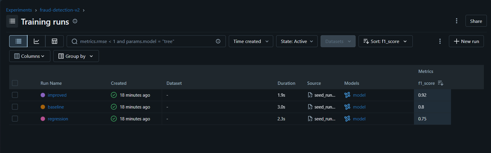

# Day 030: End-to-End MLflow Lifecycle: Train, Register, Serve, Monitor

**Category**: ML Experimentation | **Difficulty**: 🔴 Advanced

---

## Problem

The xFusionCorp Industries MLOps team needs the `fraud-detection-v2` candidate promoted all the way from the tracking server to live inference and monitored end to end. The backing stack (PostgreSQL, SeaweedFS, MLflow tracking server, three candidate runs) is already in place. The job is to cover what's left: pick a winner, register it, serve it, and monitor it.

1. The `fraud-detection-v2` experiment has three candidate runs (`baseline`, `improved`, `regression`) with logged `f1_score` metrics.
2. A registered model named `fraud-detector-v2` needs to exist, with a `champion` alias pointing at whichever run scored highest.
3. An `mlflow models serve` process needs to be listening on port `5001`, serving `models:/fraud-detector-v2@champion`.
4. Hitting `GET /health` on that server should return `200`.
5. A shell script at `/root/code/monitor.sh` should exist, be executable, check `/health` once, and exit `0` when healthy.

---

## Solution

### Step 1: Find the best run

Open the `fraud-detection-v2` experiment in the MLflow UI and sort the runs table by the `f1_score` column. `improved` comes out on top at 0.92, ahead of `baseline` (0.80) and `regression` (0.75).



### Step 2: Register it and tag it as champion

Open the `improved` run, go to its artifacts, and register the logged model under a new model name, `fraud-detector-v2`. That becomes version 1. Then go to that version's page and add an alias called `champion` pointing at it.

### Step 3: Serve it

Before running the serve command, export the tracking URI in the same shell:

```bash
export MLFLOW_TRACKING_URI=http://localhost:5000
```

This matters because `models:/fraud-detector-v2@champion` isn't a file path — it's a question MLflow has to ask the tracking server ("who is `champion` right now?"). Without the URI set, there's nothing to ask.

Then start the server in the background so the terminal stays usable:

```bash
nohup mlflow models serve -m "models:/fraud-detector-v2@champion" -p 5001 --env-manager=local > /tmp/serve.log 2>&1 &
```

Check it came up:

```bash
curl -i http://localhost:5001/health
```

You should get back `HTTP/1.1 200 OK`. Worth noting: your shell never needed S3 credentials for any of this — the tracking server is the one that goes and fetches the actual model file from SeaweedFS, not your serving process.

### Step 4: Write the health check

```bash
#!/usr/bin/env bash
set -u
if curl -sf -o /dev/null http://localhost:5001/health; then
  echo "healthy"
  exit 0
fi
echo "unhealthy"
exit 1
```

Make it executable and run it once to confirm:

```bash
chmod +x /root/code/monitor.sh
/root/code/monitor.sh
```

It should print `healthy` and exit with status `0`.

---

## Key Takeaways

### Aliases are a layer of indirection, on purpose
`@champion` isn't tied to a specific version forever — it's a label you can move. When a better model comes along, you re-point the alias instead of touching any serving code. Anything referencing `@champion` just picks up the new version the next time it loads the model.

### The tracking server is the one with the keys to the artifact store
Your serving shell doesn't need AWS/S3 env vars because it's not the one talking to SeaweedFS — the tracking server is. That's a nice side effect of routing everything through `MLFLOW_TRACKING_URI`: credentials live in one place instead of being copied to every machine that serves a model.

### `curl -sf` is the whole health check, in one flag combo
`-f` makes curl fail (non-zero exit) on a bad HTTP status instead of silently printing an error page and exiting 0. `-s` just keeps it quiet, and `-o /dev/null` throws away the response body since you only care about the status. That's why `if curl -sf ...; then echo healthy; fi` is basically the standard one-liner for liveness checks everywhere — cron jobs, Kubernetes probes, CI gates.

---
